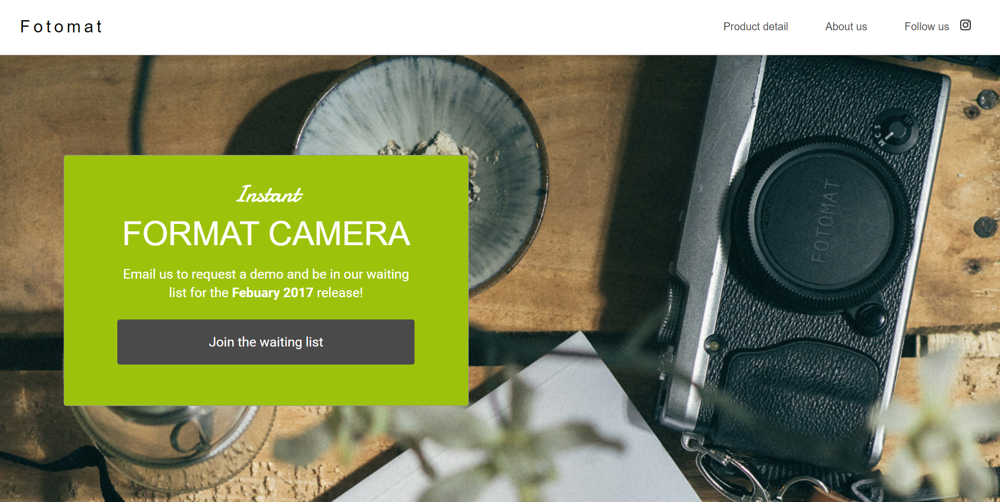
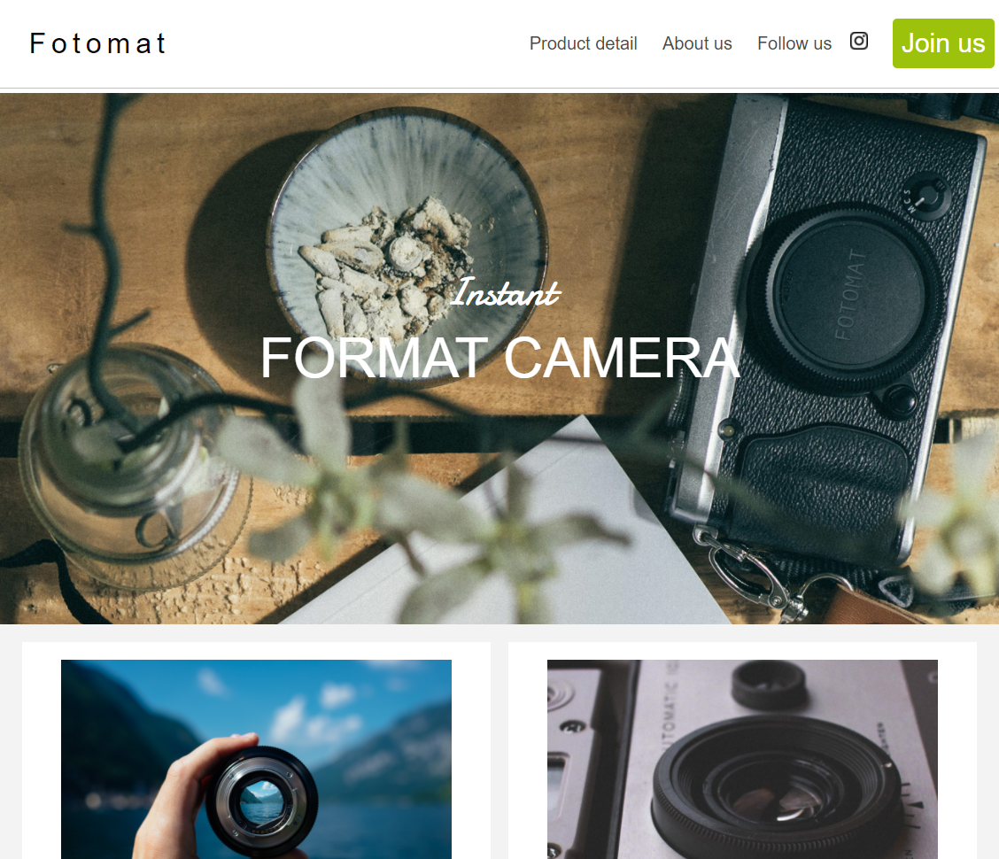
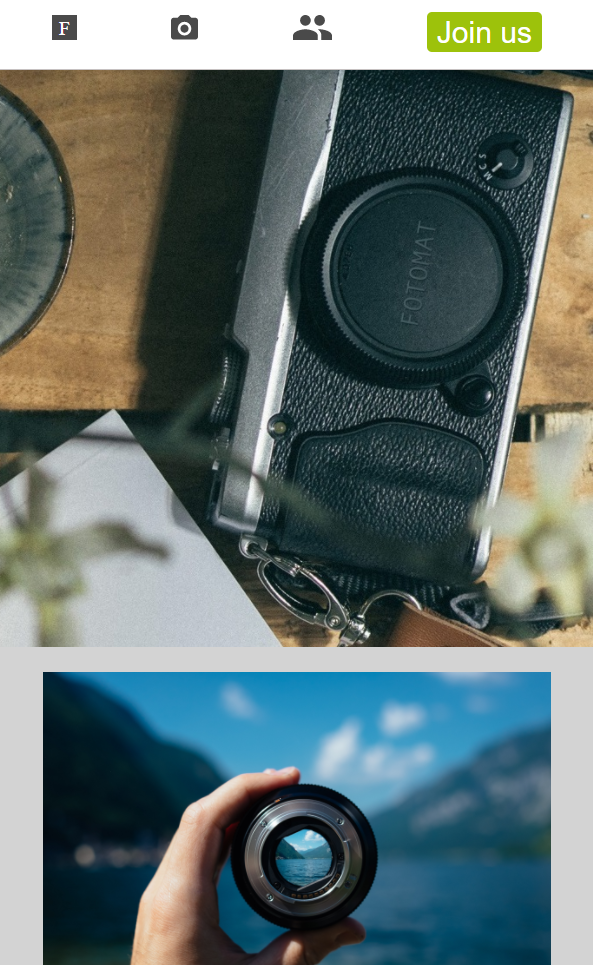

# Project: Fotomatic
#### The aim of the project: to fix a broken version of a responsive website
## Table of contents:
* [General info](#general-info)
* [Technologies](#technologies)
* [Screenshot](#screenshot)
* [Launch](#launch)
* [Sources](#sources)

## General info:
* This project is a part of Codecademy Full-Stack Engineering Path

## Technologies:
* HTML
* CSS
* Markdown
* Git
* GitHub
* Visual Studio Code 1.63.0

## Screenshots: 

#### LANDING PAGE

#### TABLET

#### MOBILE

## Launch:
Click on [the link](https://20dom21.github.io/fotomatic/).

## Sources:
https://content.codecademy.com/courses/freelance-1/capstone-1/specs/fotomatic_spec_landing.png
